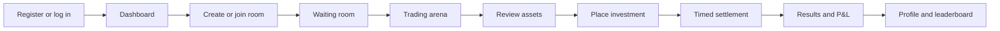
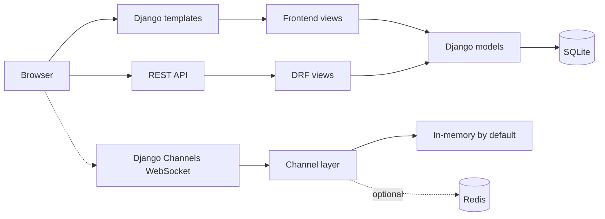

# Trade League

Trade League is a gamified virtual trading league where players compete head-to-head by allocating virtual capital across simulated market assets within a timed game room.

## Overview

Trade League turns stock-market concepts into a short competitive game. Users register, create or join a room, wait for an opponent, review available assets, and place virtual investments before the timer expires. At settlement, the application simulates price movement from each asset's growth, risk, and match duration, then compares player profit and loss.

Unlike a basic stock tracker, the implementation is match-oriented: investments belong to rooms, and results update a player's cumulative profit, balance, games played, win streak, and league level.

## Key Features

- Username/password registration and Django session login.
- Head-to-head rooms with private codes and public rooms.
- 5-, 10-, and 15-minute trading sessions.
- Virtual account balance starting at ₹100,000.
- Asset browsing by price, sector, growth, risk, and market information.
- Investment placement with account-balance validation.
- Simulated profit/loss settlement using asset trends, risk volatility, and room duration.
- Results with wins, losses, draws, investments, weak picks, and missed growth opportunities.
- Dashboard statistics and a top-ten leaderboard.
- Market overview and asset-detail pages.
- Dark responsive pixel-art UI styled with Tailwind CSS via CDN.
- TradingView chart widget and browser-side indicators on asset-detail pages.
- REST API endpoints for users, rooms, assets, investments, profiles, and leaderboard data.
- Django Channels WebSocket room routing, with optional Redis support.

## How It Works



1. Registration creates a `Profile` with a ₹100,000 starting balance.
2. A player creates a private/public `GameRoom`, or joins by room code.
3. The host starts the match after an opponent joins.
4. Players invest within their available balance.
5. Settlement calculates outcomes and updates both profiles.

## Tech Stack

| Layer | Technology |
| --- | --- |
| Language | Python 3.11 in the Docker image |
| Backend | Django 4.2–5.0, Django REST Framework |
| Realtime | Django Channels, Daphne, optional `channels-redis` |
| Frontend | Django templates, HTML, CSS, browser JavaScript |
| Styling | Tailwind CSS CDN and custom pixel/neon CSS |
| Charts | TradingView, Lightweight Charts, and Chart.js scripts from CDNs |
| Database | SQLite (`db.sqlite3`) |
| Authentication | Django sessions; DRF JWT authentication is configured |
| Deployment | Docker, Docker Compose, Render configuration |

There is no React application or Node.js build configuration in this repository.

## Architecture



HTTP is handled by Django. The ASGI application routes `ws/room/<code>/` to Channels. SQLite and an in-memory channel layer are the defaults; the production Compose file adds Redis and Nginx.

## Project Structure

```text
TradeLeague/
├── fintech_backend/       # Django settings, URL routing, ASGI/WSGI entry points
├── game/
│   ├── models.py          # Asset, GameRoom, Profile, Investment
│   ├── views.py           # REST API views
│   ├── views_frontend.py  # Server-rendered game flow
│   ├── consumers.py       # WebSocket room consumer
│   ├── routing.py         # WebSocket routes
│   ├── analysis.py        # Match profit/loss simulation
│   ├── templates/         # HTML pages
│   ├── migrations/        # Database migrations
│   └── management/        # seed_assets command
├── Dockerfile
├── docker-compose.yml
├── docker-compose.prod.yml
├── entrypoint.sh
├── manage.py
├── requirements.txt
└── render.yaml
```

## Installation

### Prerequisites

- Python 3.11 or a compatible version supported by `requirements.txt`.
- Docker Desktop and Docker Compose for the container workflow.
- Git for cloning.

### Local Python setup

Windows PowerShell:

```powershell
py -3 -m venv .venv
.\\.venv\\Scripts\\Activate.ps1
python -m pip install -r requirements.txt
python manage.py migrate
python manage.py seed_assets
```

macOS/Linux:

```bash
python3 -m venv .venv
source .venv/bin/activate
python -m pip install -r requirements.txt
python manage.py migrate
python manage.py seed_assets
```

`seed_assets` inserts sample assets only when the asset table is empty.

## Environment Variables

The application loads a root-level `.env` file. Do not commit real secrets.

| Variable | Purpose |
| --- | --- |
| `SECRET_KEY` | Django signing key. |
| `DEBUG` | Django debug mode. |
| `ALLOWED_HOSTS` | Comma-separated accepted hostnames. |
| `CSRF_TRUSTED_ORIGINS` | Comma-separated trusted origins, including scheme. |
| `CORS_ALLOW_ALL_ORIGINS` | Enables permissive CORS when truthy. |
| `CORS_ALLOWED_ORIGINS` | Allowed CORS origins when permissive mode is disabled. |
| `REDIS_URL` | Optional Redis URL; blank uses in-memory Channels. |
| `RENDER_EXTERNAL_HOSTNAME` | Optional Render hostname. |
| `PORT` | Container port; defaults to `8000`. |

## Running the Application

### Docker Compose

From the repository root, with Docker Desktop running:

```bash
docker compose up --build
```

Open [http://localhost:8000](http://localhost:8000). The container entrypoint runs migrations, collects static files, seeds assets, and starts Daphne.

For background execution and logs:

```bash
docker compose up --build -d
docker compose logs -f
```

Stop the service:

```bash
docker compose down
```

### Local server

After installation:

```bash
python manage.py runserver
```

The site is available at [http://127.0.0.1:8000](http://127.0.0.1:8000). To run the ASGI server directly:

```bash
daphne -b 127.0.0.1 -p 8000 fintech_backend.asgi:application
```

## Core Functionality

### Data model

- `Asset`: base price, growth percentage, risk, sector, and market information.
- `GameRoom`: host, opponent, room code, duration, status, start time, and settlement state.
- `Investment`: player allocation linked to a room and asset.
- `Profile`: balance, cumulative profit, games played, win streak, league, and active room.

### Profit/loss simulation

The `analyze` function creates a deterministic random sequence from the room and investment values. It combines the asset growth trend, risk-dependent volatility, and a time factor based on the 5-, 10-, or 15-minute duration. It returns player profit totals, positive/negative decisions, diversification score, and a `balanced` or `aggressive` classification.

### League levels

| Cumulative profit | League |
| ---: | --- |
| Below ₹50,000 | `NPC` |
| ₹50,000–₹199,999 | `VALID` |
| ₹200,000–₹999,999 | `MAIN` |
| ₹1,000,000+ | `GOAT` |

## API Documentation

Routes are mounted below `/api/`.

| Method | Endpoint | Auth | Description |
| --- | --- | --- | --- |
| POST | `/api/register/` | Public | Creates a user from `username` and `password`. |
| GET | `/api/rooms/` | Public | Lists rooms with `waiting` status. |
| POST | `/api/create-room/` | Required | Creates a game room. |
| POST | `/api/join-room/<code>/` | Required | Joins a room by code. |
| GET | `/api/assets/` | Public | Lists all assets. |
| GET | `/api/assets/<asset_id>/` | Public | Returns one asset. |
| POST | `/api/invest/` | Required | Creates an investment from `roomId`, `assetId`, and `amount`. |
| GET | `/api/leaderboard/` | Public | Returns the top 20 profiles by profit. |
| GET | `/api/me/` | Required | Returns the authenticated profile summary. |
| GET | `/api/health/` | Public | Returns a backend health response. |

The browser-facing flow also includes `/dashboard/`, `/lobby/`, `/create-room/`, `/game/<room_id>/`, `/market/`, and `/result/<room_id>/`.

## WebSockets

The ASGI application exposes:

```text
ws/room/<room_code>/
```

`RoomConsumer` broadcasts received text messages to other connections in the room group. Redis can be enabled with `REDIS_URL`; otherwise the in-memory layer is used.

## Database

The default database is SQLite at `db.sqlite3`. Migrations create `Asset`, `GameRoom`, `Profile`, and `Investment` models. Profiles extend Django's user model through a one-to-one relationship, while investments link users, rooms, and assets.

## UI / UX

The interface uses a dark pixel-art style with neon accents, shared navigation, responsive layouts, cards, forms, tables, a trading countdown, market pages, an investment form, and result summaries. Templates load Tailwind CSS, Google Fonts, Chart.js, Lightweight Charts, and TradingView scripts from external CDNs. Asset detail pages embed a TradingView chart and browser-side indicator labels.

## Engineering Highlights

- Shared Django templates and base styling support a consistent multi-page UI.
- A post-save signal creates a profile when a user registers.
- Settlement checks the room's `settled` flag to avoid repeating profile updates.
- The Docker entrypoint automates migrations, static files, seed data, and ASGI startup.
- Channels supports room-scoped WebSocket broadcasting with optional Redis.
- WhiteNoise is configured for static-file serving.

## Future Improvements

These are not current features:

- Add automated tests for authentication, room lifecycle, investment validation, and settlement.
- Persist price history and simulated market events rather than calculating outcomes only at result time.
- Apply consistent validation and error handling across REST and HTML flows.
- Add JWT obtain/refresh endpoints for token-based API clients.
- Use a production database and durable Redis channel layer for scaled deployments.
- Add API schema documentation, repository-owned frontend assets, screenshots, and a hosted demo.

## Learning Outcomes

This project demonstrates Django structure, relational modeling, form handling, session authentication, REST endpoints, Channels/ASGI routing, deterministic simulation logic, Docker deployment, static-file handling, and server-rendered responsive UI development.

## Project Status

Deployed using render and available for demonstration.

## Live Demo

[TradeLeague](https://tradeleague-8w55.onrender.com/)

## License

No license file is currently included in the repository.
