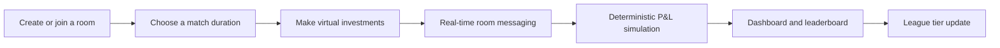

# Trade League

Trade League is a real-time, head-to-head virtual trading game built with Django Channels. Players compete in room-based matches by making virtual investments and comparing their simulated profit and loss.

## Features

- Room-scoped WebSocket messaging for real-time matches.
- Private rooms with room codes and public rooms available for opponents.
- Match durations of 5, 10, and 15 minutes.
- Deterministic profit-and-loss simulation using seeded randomness.
- Simulation based on asset growth, risk-based volatility, and duration-based time factors.
- Ten REST API endpoints covering the core gameplay flow.
- Dashboard analytics for cumulative performance.
- Four cumulative-profit league tiers: `NPC`, `VALID`, `MAIN`, and `GOAT`.
- Top-20 leaderboard ranked by cumulative profit.
- TradingView chart integration for market visualization.
- Containerized deployment on Render.

## How It Works



At the end of a match, the simulation uses a seeded random sequence together with each asset's growth and risk values. The selected match duration applies a corresponding time factor, producing repeatable profit-and-loss results for the same inputs.

## League Tiers

League tiers are assigned using cumulative profit:

| Tier | Cumulative profit |
| --- | ---: |
| `NPC` | Below INR 50,000 |
| `VALID` | INR 50,000-INR 199,999 |
| `MAIN` | INR 200,000-INR 999,999 |
| `GOAT` | INR 1,000,000+ |

## REST API

The gameplay flow is exposed through 10 REST API endpoints under `/api/`:

| Method | Endpoint | Purpose |
| --- | --- | --- |
| POST | `/api/register/` | Register a player. |
| GET | `/api/rooms/` | List waiting rooms. |
| POST | `/api/create-room/` | Create a room. |
| POST | `/api/join-room/<code>/` | Join a room by code. |
| GET | `/api/assets/` | List available assets. |
| GET | `/api/assets/<asset_id>/` | Return one asset. |
| POST | `/api/invest/` | Submit an investment. |
| GET | `/api/leaderboard/` | Return the top 20 players. |
| GET | `/api/me/` | Return the authenticated player's summary. |
| GET | `/api/health/` | Return the service health response. |

## Real-Time Communication

Room updates use Django Channels through the WebSocket route:

```text
ws/room/<code>/
```

Messages are scoped to the room so players receive updates from their current match.

## Technology

- Python and Django
- Django REST Framework
- Django Channels and ASGI
- TradingView chart integration
- Docker
- Render deployment

## Running Locally

Install the dependencies, apply migrations, and start Django:

```bash
python -m pip install -r requirements.txt
python manage.py migrate
python manage.py runserver
```

The application is available at `http://127.0.0.1:8000/`.

## Deployment

The application is containerized with Docker and configured for deployment on Render.

## Live Demo

[Trade League](https://tradeleague-8w55.onrender.com/)
